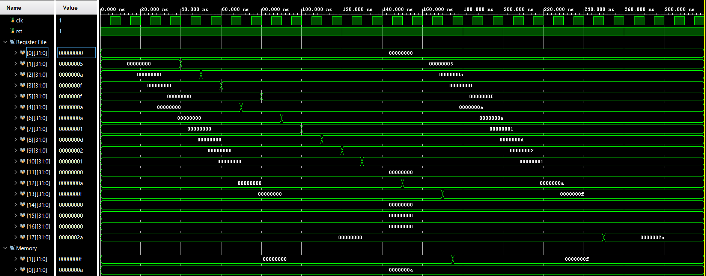

# Pipelined-5-stage-Processor
This project implements a 5-stage pipelined RISC-V processor supporting a subset of the RV32I instruction set. The processor uses separate instruction and data memories and includes full support for data forwarding, pipeline stalling, and control-hazard flushing to ensure correct execution.  

The processor supports the following instruction formats:

R-Type Instructions: ADD,SUB,SLT,OR,AND.  
These are used for register-to-register arithmetic and logical operations.

I-Type: ADDI, SLT, ORI, ANDI.  
These are used for immediate arithmetic/logical operations.

LW(load word) - This is also an I-type instruction.Its used for load operations.  

S-Type: SW .These are used for store operations.  

B-Type: BEQ, BNE . Used for conditional branching.  

J-Type: JAL . Used for unconditional jumps.  

#Testing Methodology
To verify correct functionality, we have used an assembly program that includes all supported instructions and includes creating data hazards to check if forwarding capability works.
Next, we use the load word instruction which requires pipeline stalling and finally, we test the use of beq and jal which require pipeline flushing.  

Here is the assembly program:
```
        addi x1,  x0,  5        # x1 = 5
        addi x2,  x0, 10        # x2 = 10

        add  x3,  x1,  x2       # x3 = 15        (forwarding)
        sub  x4,  x3,  x1       # x4 = 10        (forwarding)
        or   x5,  x3,  x4       # x5 = 15
        and  x6,  x3,  x4       # x6 = 10
        slt  x7,  x1,  x2       # x7 = 1

        ori  x8,  x1,  8        # x8 = 13
        andi x9,  x2,  6        # x9 = 2
        slti x10, x1, 10        # x10 = 1

        addi x11, x0, 0         # x11 = base addr = 0x0

        lw   x12, 0(x11)        # x12 = 10
        add  x13, x12, x1       # x13 = 15       (lw-use stall)

        sw   x13, 4(x11)        # Mem[4] = 15

        beq  x13, x3, target    # taken → flush

        addi x14, x0, 99        # flushed

target:
        jal  x15, done          # jump + link → flush
        addi x16, x0, 77        # flushed

done:
        addi x17, x0, 42        # x17 = 42
```
The equivalent hex code for the above assembly program have been placed in instruction memory (imem.hex) and also, data memory(dmem.hex) contains 0x0000000A at location 0.'

Expected Results: 
The expected register and memory contents (in decimal) are given below:  
x0 -> 0    
x1 -> 5  
x2 -> 10  
x3 -> 15  
x4 -> 10  
x5 -> 15  
x6 -> 10  
x7 -> 1  
x8 -> 13  
x9 -> 2  
x10 -> 1  
x11 -> 0  
x12 -> 10  
x13 -> 15  
x17 -> 42  
  
 Mem[4] -> 15  
  
A waveform snapshot is included below to confirm successful execution:  

